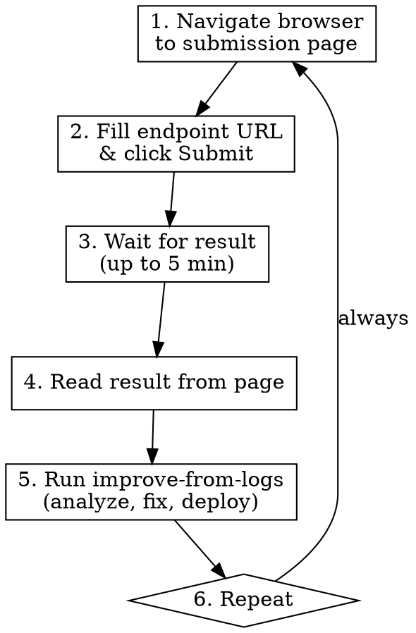

# Submit and Improve Loop

Automated loop: submit to competition via Playwright, wait for results, analyze logs, improve agent, redeploy, repeat.

## When to Use

- Continuous competition improvement grinding
- "Keep submitting and improving until I say stop"
- Automated submit-analyze-fix-deploy cycles

## The Loop



## Constants

- **Submission page**: `https://app.ainm.no/submit/tripletex`
- **Endpoint URL**: `https://tripletex-agent-rzkmnmpmpq-lz.a.run.app/solve`
- **Max wait**: 300000ms (5 minutes) per submission

## Step 1: Navigate & Submit

Navigate to the submission page:

```
mcp__plugin_playwright_playwright__browser_navigate(url: "https://app.ainm.no/submit/tripletex")
```

Then take a snapshot to find the form elements:

```
mcp__plugin_playwright_playwright__browser_snapshot()
```

Find the endpoint URL input field and the submit button. Fill the URL and click submit:

```
mcp__plugin_playwright_playwright__browser_fill_form(fields: [{"ref": "<input_ref>", "value": "https://tripletex-agent-rzkmnmpmpq-lz.a.run.app/solve"}])
mcp__plugin_playwright_playwright__browser_click(element: "Submit button", ref: "<submit_button_ref>")
```

**If the page looks like a login page or session expired**: Tell the user to log in manually (`! open https://app.ainm.no/submit/tripletex`), then retry.

## Step 2: Wait for Result

The submission takes up to 5 minutes. Wait for completion indicators:

```
mcp__plugin_playwright_playwright__browser_wait_for(text: "completed", timeout: 300000)
```

If wait_for times out, take a screenshot to see what happened and report to user:

```
mcp__plugin_playwright_playwright__browser_take_screenshot()
```

## Step 3: Read Result

Take a snapshot to capture the submission result:

```
mcp__plugin_playwright_playwright__browser_snapshot()
```

Look for:
- Score (e.g., "7/7", "6/8")
- Task type that was tested
- Any error messages

Report the result concisely to the user (one line).

## Step 4: Improve from Logs

Invoke the `improve-from-logs` skill:

```
Skill(skill: "improve-from-logs")
```

This will:
1. Pull production logs from the submission window
2. Identify failures and inefficiencies
3. Implement fixes in agent.py / api_docs.py
4. Deploy the updated agent
5. Save failures to failed_prompts.json

**IMPORTANT**: The improve-from-logs skill deploys. Wait for deploy to finish before next submission.

## Step 5: Repeat

Go back to Step 1. Never stop unless the user says to stop.

## Error Recovery

| Problem | Action |
|---------|--------|
| Browser session lost / MCP error | Navigate fresh — don't debug the old session |
| Login page shown | Tell user to log in, wait, then retry |
| Submission stuck > 5 min | Take screenshot, move to logs anyway |
| Deploy failed | Fix the issue, redeploy, then continue loop |
| No failures in logs | Focus on efficiency optimization instead |
| Page shows "rate limited" | Wait 60s, then retry submission |

## What NOT to Do

- Don't try to fix Playwright MCP bugs — just navigate fresh
- Don't skip the improve step — every submission is a learning opportunity
- Don't submit without deploying first if changes were made
- Don't spend more than 10 minutes on improvements per cycle — ship fast
