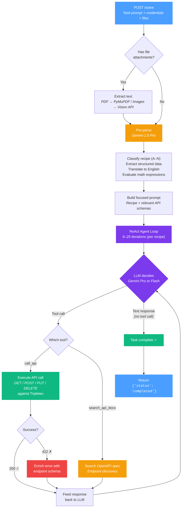

# Tripletex AI Agent

### NM i AI 2026 — Norwegian National Championship in AI

> An autonomous AI agent that completes real-world accounting tasks in [Tripletex](https://tripletex.no) — handling 30 task types across 7 languages, from simple customer creation to complex year-end closing, by classifying multilingual prompts into structured recipes and executing multi-step API workflows with error recovery.

---

## Highlights

- **Multilingual NLP** — processes task prompts in 7 languages (Norwegian Bokmål, Nynorsk, English, Spanish, Portuguese, German, French) with reliable data extraction and translation
- **Automated recipe classification** — pre-parser classifies 30 task types into 14 execution recipes, each with tailored API schemas and step-by-step instructions
- **Adaptive model selection** — uses Gemini 2.5 Pro for complex recipes and Flash for simpler ones, with automatic downgrade under time pressure to stay within the 5-minute timeout
- **Self-healing error recovery** — 422 errors are enriched with endpoint schema context and fed back to the LLM, enabling the agent to correct and retry without human intervention
- **Two-tool simplicity** — the entire accounting domain is handled with just `call_api` and `search_api_docs`, keeping the agent focused and reliable

---

## The Competition

**NM i AI** (Norgesmesterskapet i AI) is Norway's national AI championship. The 2026 Tripletex challenge: build an agent that completes accounting tasks — creating customers, registering employees, issuing invoices, recording payments, handling payroll — via the Tripletex API.

- **30 task types** across 56 variants (7 languages × 8 data sets)
- **5-minute timeout** per task
- Tasks arrive in Norwegian Bokmål, Nynorsk, English, Spanish, Portuguese, German, and French
- Scored on **correctness** (field-by-field verification) and **efficiency** (fewer API calls + zero errors = bonus points)

---

## How It Works

The agent uses a **two-stage architecture**: a pre-parser classifies the task and extracts structured data, then a focused ReAct loop executes the right recipe.



### The Two Tools

The LLM has exactly two tools:

| Tool | Purpose |
|------|---------|
| `call_api` | Make HTTP requests (GET/POST/PUT/DELETE) to the Tripletex API |
| `search_api_docs` | Search the Tripletex OpenAPI spec to discover endpoints and required fields |

The LLM decides which endpoints to call, what data to send, and how to recover from errors — guided by a recipe-specific system prompt with pre-injected API schemas.

---

## 14 Task Recipes

Each task is classified into one of 14 recipes (A–N) by the pre-parser. Each recipe has step-by-step instructions, relevant API schemas, and tuned iteration limits embedded in the system prompt.

| Recipe | Task Type | Complexity | Typical API Calls |
|--------|-----------|-----------|-------------------|
| **A** | Department | Simple | 1 |
| **B** | Employee | Simple–Medium | 2–8 |
| **C** | Customer / Supplier | Simple | 1 |
| **D** | Project | Medium–Complex | 3–15 |
| **E** | Product | Simple | 1–2 |
| **F** | Invoice (outgoing) | Complex | 5–9 |
| **G** | Payment | Complex | 4–25 |
| **H** | Travel Expense | Medium | 3–8 |
| **I** | Voucher / Supplier Invoice | Complex | 3–10 |
| **J** | Corrections (credit note/reversal) | Medium | 2–4 |
| **K** | Timesheet | Complex | 4–14 |
| **L** | Payroll | Complex | 5–9 |
| **M** | Ledger Analysis | Complex | 4–10 |
| **N** | Year-End Closing | Very Complex | 8–25 |

---

## Two-Stage LLM Strategy

| Stage | Model | Purpose |
|-------|-------|---------|
| **Pre-parse** | Gemini 2.5 Pro | Translate multilingual prompt → structured English, classify recipe, extract all data fields, evaluate math expressions |
| **Execution** | Gemini 2.5 Pro or Flash | Run the ReAct loop with a focused, recipe-specific system prompt |

Complex recipes (F, G, I, K, L, M, N) use Pro for execution; simpler recipes use Flash. If running low on time (>150s elapsed, >10 iterations), the agent automatically downgrades Pro → Flash to finish within the 5-minute timeout.

---

## Examples

Simple task — create a customer from a Norwegian prompt:

```
"Opprett en kunde med navn Fjord Solutions AS,
 organisasjonsnummer 987654321,
 adresse Storgata 15, 3015 Drammen"
```

→ Pre-parse classifies as **Recipe C** → POST `/v2/customer` with structured address

Multi-step task — register a payment:

```
"Register a payment for invoice #42 — full amount, paid today"
```

→ Pre-parse classifies as **Recipe G** → GET invoice (with date range) → GET payment types → PUT `:payment`

Complex task — record a supplier invoice from a PDF:

```
"Bokfør vedlagt faktura fra leverandøren"
+ attached invoice.pdf
```

→ Extract text from PDF via PyMuPDF → Pre-parse classifies as **Recipe I** → Look up VAT types → POST `/v2/ledger/voucher` with balanced debit/credit postings

---

## Tech Stack

| Component | Technology |
|-----------|-----------|
| Language | Python 3.12 |
| Web Framework | FastAPI + Uvicorn |
| LLM | Gemini 2.5 Pro/Flash via Vertex AI |
| LLM Client | OpenAI SDK (Vertex AI-compatible endpoint) |
| API Client | requests (sync) |
| PDF Processing | PyMuPDF + Gemini Vision API (scanned docs) |
| Auth | GCP service account (Cloud Run) / gcloud CLI (local) |
| Deployment | Docker → Google Cloud Run (europe-north1) |
| Testing | pytest — unit, e2e, and tuning tests |

---

## Project Structure

```
tripletex-agent/
├── src/
│   ├── main.py              # FastAPI app, /solve and /health endpoints
│   ├── orchestrator.py       # File processing → agent loop coordination
│   ├── agent.py              # ReAct loop, pre-parser, recipes, model selection
│   ├── api_docs.py           # OpenAPI spec search + endpoint registry (76 endpoints)
│   ├── tripletex_client.py   # HTTP wrapper for Tripletex API
│   ├── file_processor.py     # PDF/image/CSV text extraction
│   ├── vertex_auth.py        # GCP Vertex AI authentication
│   ├── models.py             # Pydantic request/response schemas
│   ├── config.py             # Environment configuration
│   └── logging_config.py     # Structured JSON logging with redaction
├── tests/
│   ├── test_*.py             # Unit & integration tests
│   ├── e2e/                  # End-to-end tests against Tripletex sandbox
│   └── tuning/               # Efficiency tests (real LLM + mock API client)
│       ├── test_*.py          # 12 recipe-specific test files
│       └── mock_client.py     # Mock Tripletex client for tuning
├── knowledge/                # Gitignored — architecture docs, recipes, gotchas
├── Dockerfile
├── pyproject.toml
└── CLAUDE.md
```

---

## Running Locally

```bash
# Install dependencies
pip install -e ".[dev]"

# Start the server (uses gcloud CLI for Vertex AI auth)
uvicorn src.main:app --port 8080

# Run unit + integration tests
python3 -m pytest --tb=short

# Run tuning tests (requires Vertex AI access — uses real LLM)
python3 -m pytest tests/tuning -v -n auto
```

No API keys needed — authentication uses your GCP service account (Cloud Run) or `gcloud auth` (local).

---

## Deployment

Deployed as a serverless container on Google Cloud Run:

```bash
gcloud run deploy tripletex-agent \
  --source . \
  --region europe-north1 \
  --allow-unauthenticated \
  --memory 512Mi \
  --timeout 300 \
  --port 8080
```

---

## Architecture Decisions

**Why two stages (pre-parse + execution)?** Multilingual prompts in 7 languages need reliable data extraction before the agent can act. The pre-parser translates and structures the task into a canonical format with recipe classification, so the execution stage gets a focused prompt with only the relevant API schemas — not the entire OpenAPI spec.

**Why ReAct over plan-then-execute?** Earlier versions generated a full plan upfront, then executed it blindly. This failed when the API returned unexpected validation errors or when tasks required dynamic lookups (e.g., finding a customer by org number before creating a project). The ReAct loop lets the agent adapt on every step.

**Why only 2 tools?** Simplicity. The LLM is good at figuring out multi-step workflows when given just `call_api` and `search_api_docs`. More tools would mean more confusion in the prompt, more edge cases, and slower iteration.

**Why per-recipe iteration limits?** Creating a department takes 1 API call; year-end closing takes 25. A flat limit either wastes time on simple tasks or cuts off complex ones. Dynamic limits (6–25) match task complexity.

**Why auto-generate the system prompt from the OpenAPI spec?** Earlier versions had hand-written endpoint docs that drifted from reality. Now, field names and schemas are extracted from the live spec at startup, required markers come from a curated endpoint registry validated by tests, and 422 error hints include real schema fields. The spec is the single source of truth.

**Why tuning tests with real LLM + mock API?** Unit tests can't catch prompt regressions — a "passing" test might still produce 15 unnecessary API calls in production. Tuning tests run the actual LLM against a mock Tripletex client and assert on zero errors + minimal call counts, catching efficiency regressions before deployment.

---

*Built for [NM i AI 2026](https://ainm.no).*
